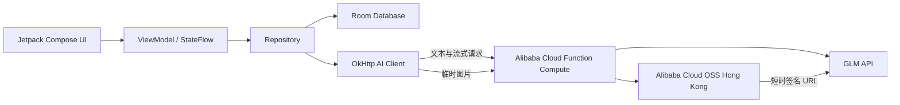

# Cogno

> 从对话到可复用笔记的本地优先 Android AI 知识整理工具。

[](https://github.com/ntoprevd/Cogno/releases/latest)
[](https://github.com/ntoprevd/Cogno/releases/latest)
[](https://kotlinlang.org/)

Cogno 是一个 Kotlin + Jetpack Compose 原生 Android 项目。它围绕“对话、结构化笔记、主题知识”构建完整闭环：与 AI 交流，将对话整理成可继续更新的笔记，再从多篇笔记中提取片段并按主题聚合。

## 下载

前往 [GitHub Releases](https://github.com/ntoprevd/Cogno/releases/latest) 下载最新签名 APK。

- 当前版本：`v1.0.1`
- 最低系统：Android 10（API 29）
- 安装 APK 时，Android 可能要求授权当前文件管理器“安装未知应用”。

## 核心功能

### AI 对话

- 支持 SSE 流式回复、停止生成、失败重试和重新生成。
- 支持编辑用户消息后从该位置重新生成回复。
- 支持 GLM 体验模型和用户自定义 OpenAI-compatible API。
- 支持 GLM-4.6V 图片理解；聊天气泡继续使用本地图片。
- 支持语音输入、基础 Markdown、代码块、表格和消息反馈。
- 根据前几轮对话自动生成会话标题。

### 结构化笔记

- 从会话生成简洁摘要、标准笔记或详细复习笔记。
- 会话继续后可增量更新已有笔记，避免重复创建。
- 支持查看、Markdown 编辑、搜索、重命名、置顶、删除和系统分享。
- 保留来源会话关联，可从笔记跳回原始对话。

### 主题知识

- 从多篇笔记中提取可独立理解的内容片段并按主题聚合。
- 支持自定义主题与关键词规则。
- 支持主题重命名、置顶、删除和 Markdown 导出。

### 本地与设置

- 会话、消息、笔记和主题使用 Room 保存在设备本地。
- API Key 使用 Android Keystore 加密，且不进入系统云备份。
- 支持导出聊天、笔记、主题和本地图片为 ZIP。
- 支持深色模式、中英文界面、输出风格和系统提示词配置。
- 提供隐私政策、服务条款、版本路线和系统缓存管理入口。

## 架构



体验模型的供应商密钥和 OSS RAM 密钥只存在于函数计算环境变量中，不进入 Android APK。用户自定义 API 请求则直接发送到用户配置的服务地址。

## 技术栈

- Kotlin 2.3.21 / Java 17
- Jetpack Compose / Material 3
- Navigation Compose
- Lifecycle ViewModel / StateFlow / Coroutines
- Room / KSP
- OkHttp / SSE
- Gradle Kotlin DSL
- 阿里云函数计算 FC / 阿里云 OSS

## 本地运行

### 环境要求

- Android Studio
- JDK 17
- Android SDK 36.1
- Gradle Wrapper 9.2.1

克隆项目后，在项目根目录的 `local.properties` 中配置本机 SDK。体验模型配置为可选项：

```properties
sdk.dir=YOUR_ANDROID_SDK_PATH

# 可选：开发者提供的体验模型网关
COGNO_EXPERIENCE_BASE_URL=https://your-gateway.example/v1
COGNO_EXPERIENCE_APP_TOKEN=your-app-token
```

不要将真实 GLM Key、OSS AccessKey 或其他供应商密钥写入 Android 工程。

构建 Debug 版本：

```powershell
.\gradlew.bat :app:assembleDebug
```

运行编译与单元测试：

```powershell
.\gradlew.bat :app:compileDebugKotlin :app:compileDebugJavaWithJavac
.\gradlew.bat :app:testDebugUnitTest
```

## 服务端网关

`server/` 包含 Node.js 20 网关，负责：

- 代理体验模型请求并保持 SSE 流式传输。
- 隐藏 GLM API Key。
- 将视觉图片上传至私有 OSS，并返回短时签名 URL。
- 提供基础模型列表、输入限制和演示额度控制。

部署说明见 [`server/README.md`](server/README.md)。

## 项目结构

```text
app/src/main/kotlin/com/ntoprevd/cogno/
├─ data/        Room、网络、设置、媒体与导出
├─ ui/chat/     聊天、侧边栏、欢迎页与输入交互
├─ ui/notes/    对话笔记、主题视图与笔记详情
├─ ui/settings/ 设置、资料、主题规则与法律说明
└─ ui/common/   Markdown 与通用编辑组件

server/          Node.js 体验模型网关
product-diagram/ 早期高保真视觉参考
```

`app/src/main/assets/` 中保留了早期 WebView 原型，当前运行主线为原生 Compose。

## 数据与隐私

- 本地数据默认保存在应用私有目录。
- 体验模型请求会经过 Cogno 的阿里云函数计算网关。
- 视觉图片会压缩后临时存入香港 OSS，签名 URL 通常约 15 分钟有效，临时对象最长保留 24 小时。
- 导出的 ZIP 文件由用户自行选择保存位置并负责保管。
- 体验模型使用共享额度，不承诺永久可用；长期使用可配置自己的兼容 API。

## 后续方向

- 轻量 Agent 与受控工具调用。
- 将总结、结构化笔记和主题整理能力封装为 MCP 服务。
- 扩充体验模型和 OpenAI-compatible API 适配。
- 桌面端阅读、整理与安全数据迁移体验。

以上为探索方向，不代表确定的功能承诺或发布时间。

## 项目说明

Cogno 是一个 Android 课程项目与个人作品。开发过程中使用 AI 工具辅助需求梳理、代码审查、问题定位和文档整理；产品取舍、架构整合、真机测试与发布由开发者完成。
