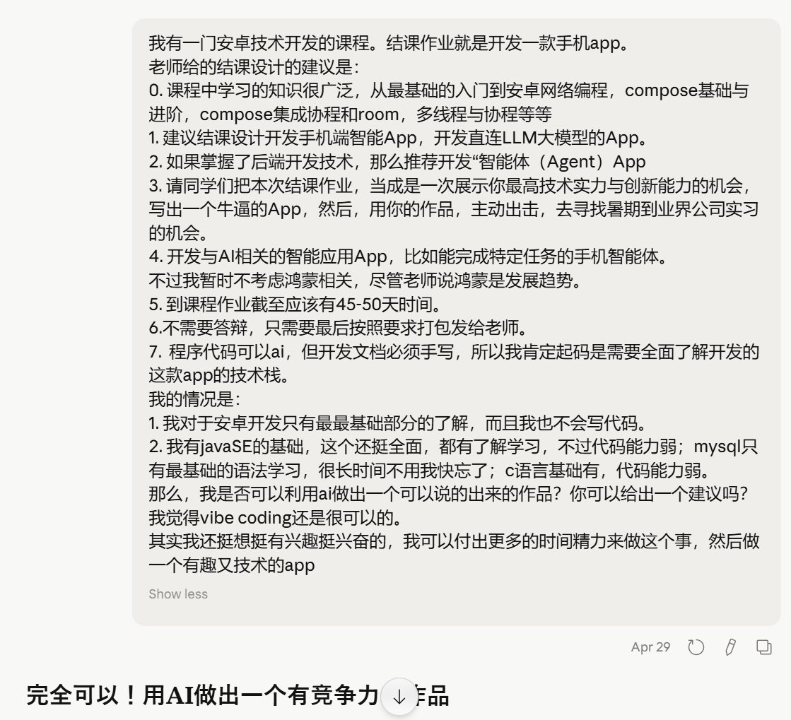

# 2026-4-29 v1

App类型：AI智能助手

App名称：Cogno

App图标：再说

功能基本设想，具体实现再说：

1. 支持多会话，参考GPT侧边栏，可新建/切换/删除/批量删除/重命名/对话
2. 对话历史本地存储。会话和消息持久化，浏览历史会话，查看完整聊天记录
3. 流式输出效果
4. 支持语音输入
5. 支持暗色模式，不同主题
6. 支持手动触发联网搜索
7. 手机平板等移动端屏幕自适应
8. markdown渲染，支持代码块、表格、列表等，代码按语言高亮
9. 支持智能生成结构化笔记。具体功能设想：用户在一个会话中与AI聊多个主题（如恋爱、哲学、java等），点击总结按钮，ai自动分析内容，按主题分类，生成 Markdown 格式的笔记。支持续写，聊天继续一段时间后，再点总结按钮ai可更新笔记总结，追加新内容且不覆盖之前内容。
10. 笔记库单独入口，生成的结构化笔记可以独立查看、编辑、导出、分享、转图片(可选)等等
11. 笔记关联会话，笔记记录对应会话及此次笔记总结覆盖的消息范围，点击跳转按钮可打开对应会话并滚动到相关消息区域
12. 聊天支持显示开始时间，年月日；笔记支持显示开始和结束时间，年月日
13. 支持切换不同大模型，自定义API接口
14. 支持多格式文件上传，txt/docx/excel/md/pdf/pptx等格式，优先实现txt/md/pdf，基于内容回答用户问题
15. (可选)导出全部数据(备份/恢复)，将所有的会话、消息、笔记导出为一个 zip 文件，或支持从 zip 恢复

随手记——便于撰写开发文档：

1. App类型来源于询问deepseek、ChatGPT、Claude、豆包等多方ai，基于趣味性、技术性、可行性，综合个人实力与课程要求，最终选定偏向学习场景的AI智能助手。

2. App名字依旧询问Deepseek，ds解释为Cognition缩写，有AI辅助认知之意，笔者仅仅认为此名字看起来高级、简洁、科技、顺眼、易读，所以选择。

3. Cogno功能，一般性功能借鉴于主流大模型，拼拼凑凑删繁就简而成；

   一些交互功能，希望让用户体验感、自定义感更强；

   在此基础上构思智能生成结构化笔记功能作为特点，来源于笔者日常生活。笔者与AI交流经常话题混合，有时探索技术兴趣，有时询问课程学习问题，有时日常生活的注意点，有时倾诉情感、个人思考等等。

   但笔者看完知识转身就忘，一项技术操作重复提问（如Git指令，一旦隔一段时间，仓库创建完全遗忘），且懒得总结从不总结；有些个人经历、情感思考的述说惊为天人、文采飞扬、文思泉涌、思想深刻（自夸），但往往昙花一现，说完就忘，且对话过长难以翻阅，不能一睹当时风采，甚是可惜。所以发掘此智能生成结构化笔记的功能，希望可以帮助有同样感受的朋友，让我们的思想漫游、孜孜求知不再湮没于文字洪流中，让它们有迹可循！

   功能完善皆有咨询AI，使其不重复，基本功能不遗漏，重要功能更精确，难点功能放后面。

4. 有了上学期使用AI完成结课设计的经验，以及笔者更早开始设计，以及这段时间的代码学习，笔者相信这次一定能实现更好的功能，产出一个真正的应用。笔者决定多花时间在功能说明、框架设置、准备工作、流程了解和学习上，不像上次太过信任AI，推进全由AI决定，很难绷。

5. B站UP主**SeekerLo**，视频：如何用Trae制作一款安卓APP（实操演示），给笔者很大启发，再结合咨询AI，确定整体的流程大致为：
   1. 明确类型与功能。应用类型，应用功能，功能是否涉及数据库。具体询问ai
   2. 技术选型与环境搭建。开发工具Android Studio、语言Java、最低SDK、数据库、网络等。具体询问ai
   3. UI结构与页面流程。让ai生成产品原型html
   4. 分模块实现功能。询问ai需求提出的格式
   5. 调试与真机验证。错误日志发给ai，问题与解决
   6. 文档等工作。