# 2026-4-30 Cogno

已经根据功能提示和一些ui设计规范要求AI生成产品原型图，例如：

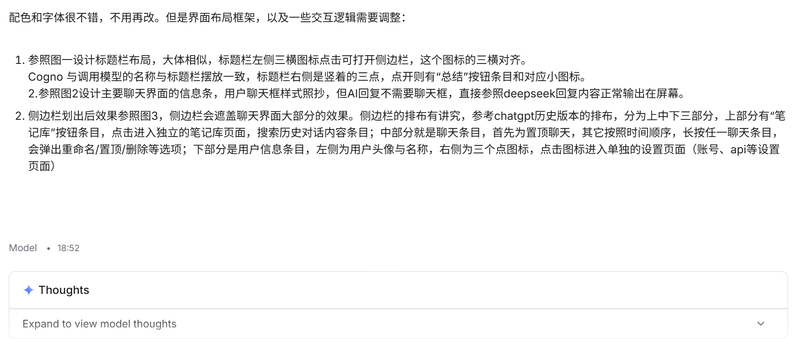

但效果只能差强人意，颜色和字体，大体框架已经有了，但还是差了意思，有些细节和交互还是需要完善。

由于笔者专业欠缺，无法精准表述需要界面布局与交互效果，于是决定来画一些较为简单的线框图，向AI传递需求，应该大有用处，笔者仍然记得大二上小学期的线框图制作。笔者借鉴了多家AI对话以及聊天软件，加上自己的使用习惯和界面爱好来绘制。

完成了主页面设计！搞了好多版本！已经超级无敌满意了。接下来过五一。

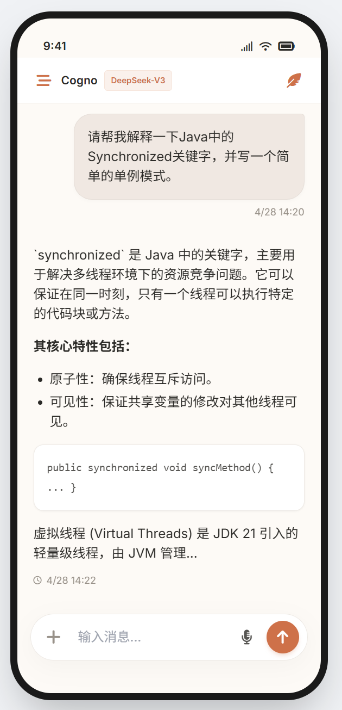

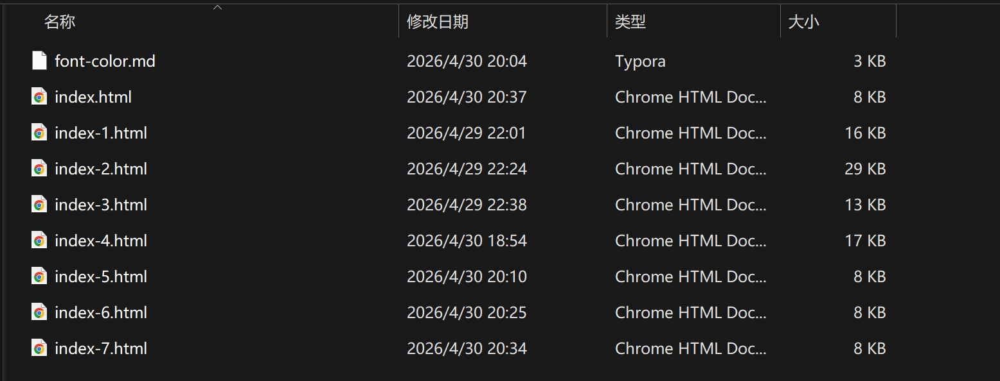

# 2026-5-7 Cogno

我们继续来设计其他的，左侧栏划出页面以及笔记库页面，可能的其他页面。

太好了，非常迅速的设计好了侧边栏ui效果，并改进了主聊天界面的小瑕疵。

我也是借鉴了许多知名大模型的ui设计哈哈。

（之前有一版本的chatGPT侧边栏和主界面，以及菜单选项我都觉得超级满意，登峰造极的好看。然而昙花一现，没过多久就消失了，现在的ui界面变简洁了，但是并没有更美观大气，反而觉得变土了。）

突然发现自己没有给出新建聊天的图标，这还了得？紧急补救，顺便再优化优化标题栏的布局。

此时非常满意，但由于没有技术，心里老是担忧，现在产品原型图好好的界面，到了不同的手机屏幕上还能适应吗？虽然一开始确实明确AI直接就是获取手机屏幕尺寸，然后弹性布局的代码逻辑，但是也不知道AI有没有实现......还是太vibe coding了。

又想到，这么设计有啥用呢？感觉就是在抄袭各家大模型，还不如直接找他们的源码来改头换面，这ai大模型太普遍了....做得没什么信心了。

今天到这里，接下来是要设计笔记库的页面展示，还有个人设置的页面展示。不过其实根本没想好哪种界面才能美观大气。明日再说！

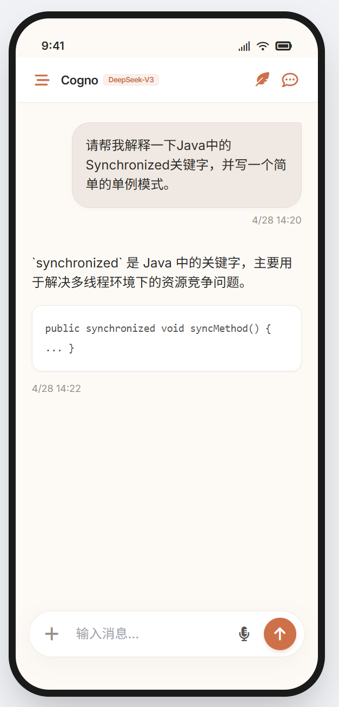

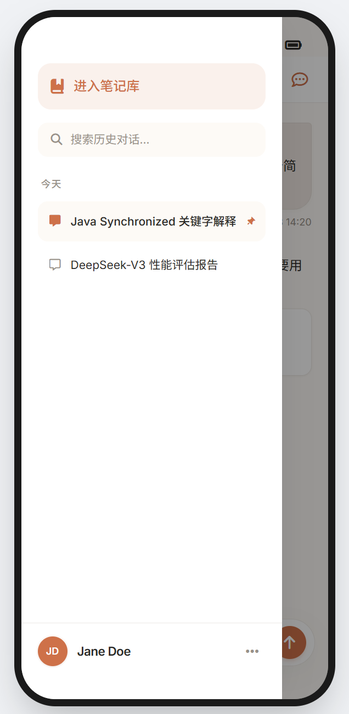

# 2026-5-11 

最后一次课，我终于来上课了。

主要还是想听AI故事和作业要求/

笔记库功能：

智能生成结构化笔记

*   **3.1 智能总结归纳**
    *   **多主题识别：** 会话中初次点击标题栏右上总结按钮（小羽毛图标）时，AI 自动识别此会话内容中，每一段对话中的逻辑断点（如从“Java”转向“恋爱”再转向“生活常识”等），并按层级生成 Markdown 标题与内容，自动在笔记库中生成新条目。注意：如果用户在对话中没有点击总结，就不用生成笔记
    *   **增量更新（核心）：** 同一会话中，再次点击总结按钮时，AI 自动对比当前笔记内容与新产生的对话记录，仅追加新知识点，保持旧内容的连贯性。
*   **3.2 笔记库入口**
    *   **独立空间：** 笔记以列表形式独立呈现，不与会话混杂。
    *   **编辑功能：** 完整的 Markdown 编辑器，支持手动修补 AI 生成的内容。
    *   每个笔记条目，长按出现菜单（置顶、删除、多选、合并笔记、重命名等等）
*   **3.3 笔记-会话联动 (Bi-directional Linking)**
    *   **跳转锚点：** （对于对话为单位的模式）每一个笔记条目可以跳转到相应对话；
    *   （两种模式都可）笔记中的每个小节可关联一个消息 ID，点击笔记旁的“跳转”图标，App 自动切换回原始会话并精准滚动定位到相关对话处。
    *   笔记条目有两种分类模式，一种就是以对话为单位，笔记条目对应对话条目；另一种以主题为单位分类，同一主题在同一笔记条目。例如，对话1中的主题/逻辑断点有Java、网络安全、友情、亲情、哲思，对话2中主体有亲情、生活常识、徒步。按照主题来分笔记条目，对话1和对话2的亲情就在一个条目。
    *   当然，这就要求对话内容的总结与分类能力很过硬。个人感觉，这其实就是以单个对话单个主题为最小单位，而分类模式只是原子的重组。你懂我意思吗？就相当于拿数据库里的不同数据组合。
*   **3.4 导出与分享**
    *   **导出：** Markdown (.md)格式

一些和ai沟通的截图记录：

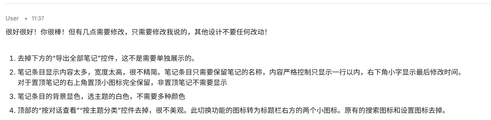

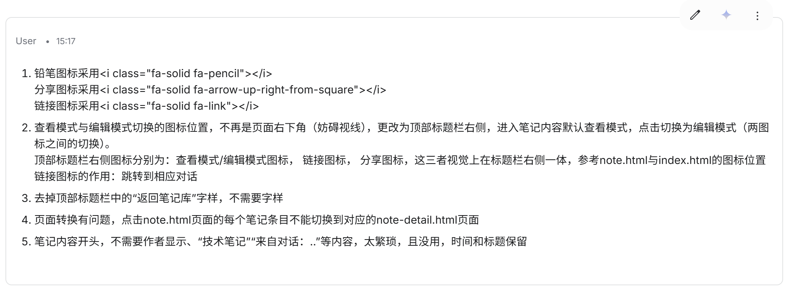

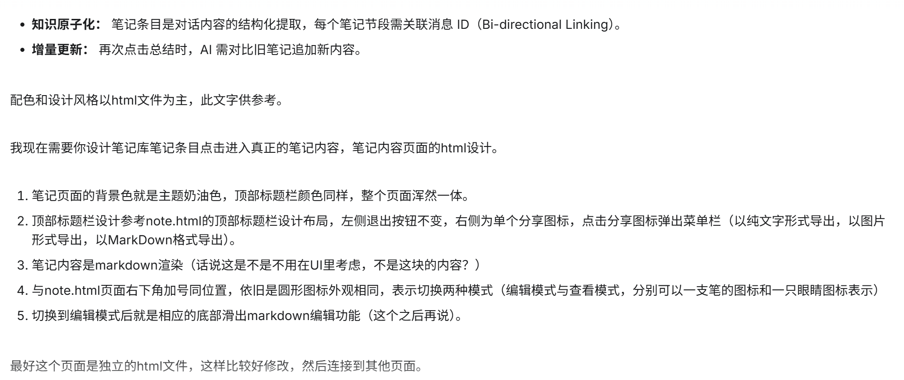

完成笔记库页面的UI设计，然后完成具体笔记内容页面的UI设计，然后再完成设置页面的UI设计！然后就完成了整个产品的UI设计！交互逻辑也差不多，虽然后续可能会改。

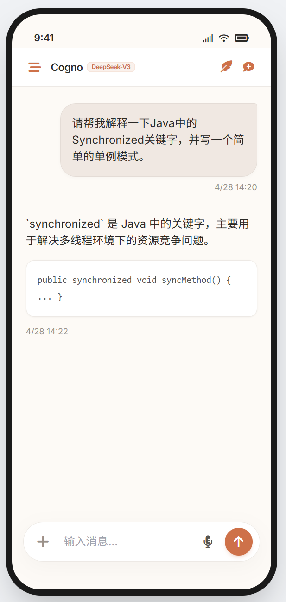

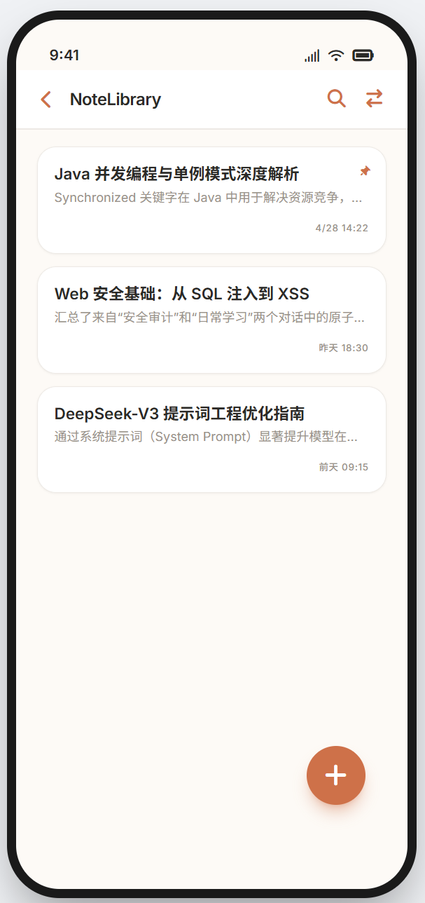

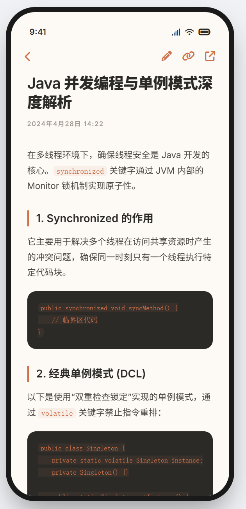

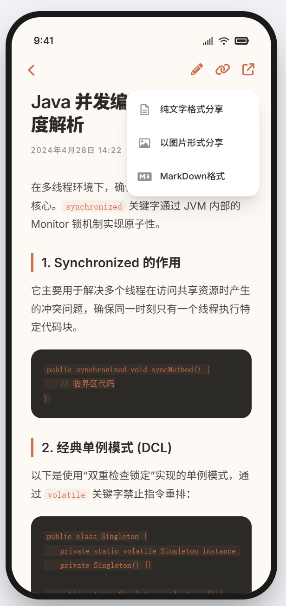

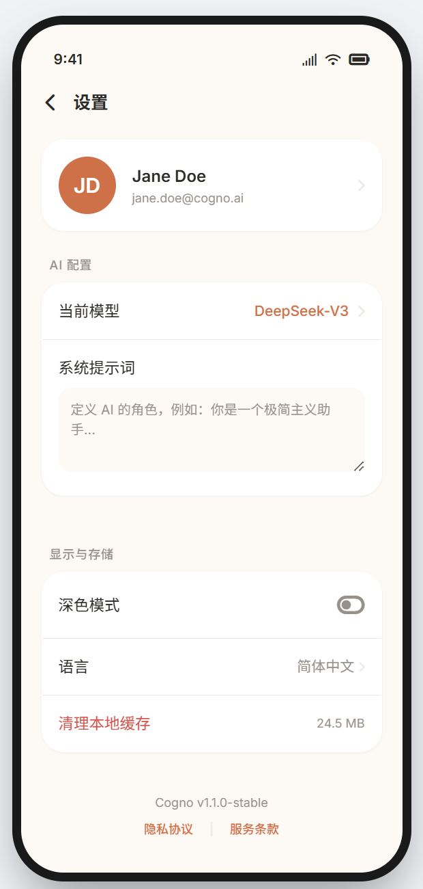

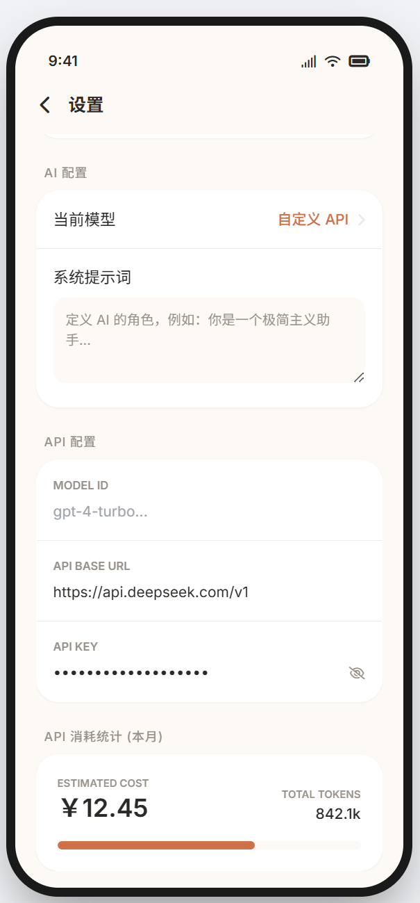

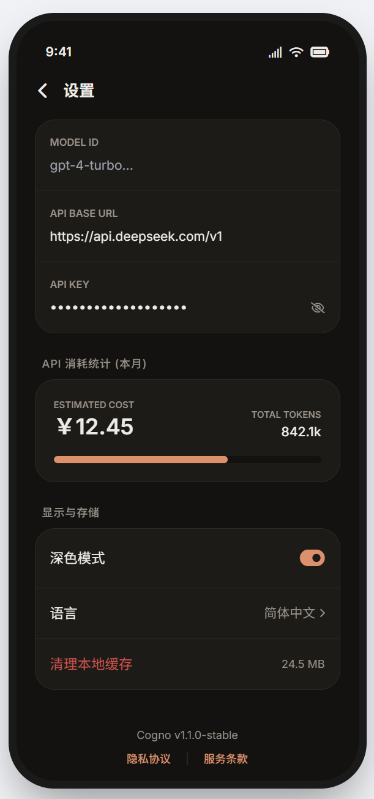

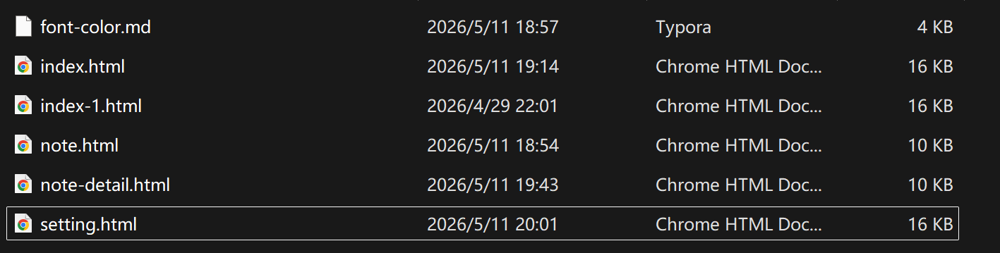

对于目前的UI效果，还是非常满意的。我希望的，就是做成app，到时候真实功能交互，也要和这个一样赏心悦目。现在只是铲平原型图的html文件代码都有1000行，才5.11，我拿什么输！！！

不过也疑虑这样做到底对不对，我感觉在这上面耗费了很多时间，主要是细枝末节的东西，但我又很喜欢就盯着一个地方看了。而且就算这里实现完美，这些代码也根本没用啊，都用不到app程序里头去。做完了才觉得自己为啥要纠结那么多。比如深色模式为什么只可以在setting.html页面显示，改来改去其他页面也不可以，但其实根本没必要，app逻辑实现的时候应该比这方便（AI说的）。而且也感觉自己有点功能越设计越多，比如这个接入API，有技术的用户会用我这app吗？没技术的用户有兴趣鼓捣这个api接口吗，还要花钱买token。有点为了功能而功能，而不是契合产品的定位（当然主要也没有明确定位，都是借鉴）

不过严格来说...还有页面设计没考虑，比如用户登录，缺省页，明日再说，或者以后再说。

vibe coding也是会累的。从此处就很能体会到，为什么需要可以直接操作文件，比如Claude code直接基于文件开命令行工作了。每次都要上传代码，不仅重复而且消费限额啊啊，而且窗口对话过多直接就又慢又卡，而且会出更多错，不得不新开窗口（经验是一个html页面一个窗口），但这样有需要提示词，虽然都是让上一个AI写，但还是觉得，不靠谱。就是AI不靠谱的这种心理，导致每隔几段对话我就忍不住重发代码，且质疑AI是否真的懂我的要求。此人也是疑神疑鬼了。究其根本，其实是因为本身技术缺失，由于无知，所以只能质疑，自己判断不了只能生硬要求AI不可以出错。还是因为没技术，连一些提示词也得思考怎么写清楚，不清楚自己改变的到底是什么部分什么组件，没有技术语言，只有自然语言，也是辛苦AI能理解。还是因为技术缺失，都不用框架（因为根本不懂），就直接开始告诉AI要怎样的UI设计，市面上的技术都不了解，不能运用。

没事可以慢慢了解慢慢学的。我不是永远不会，起码相比上次程序开发设计，我觉得我的流程已经进步很多了，而且也提前开始了很多，有机会试错也可以完成的吧！

# 2026-5-12

初始欢迎页面，依旧借鉴某次GPT的，滑动效果，感觉很丝滑，不过为什么自己页面实现，感觉空荡荡的

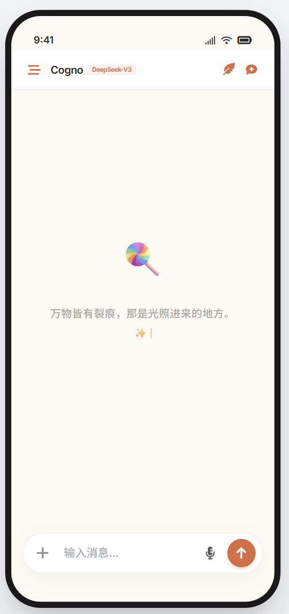